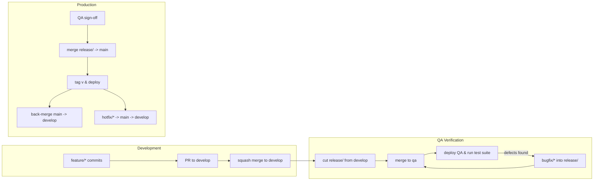

# SmartPay Engineering Collaboration Guide (Dev, QA, Prod)

A standardized working agreement for full‑stack development, QA, and production operations. It defines environments, branching, committing, merging, and traceability using the team’s SmartPay workbook (Epics → Features → User Stories).

---

## Purpose
- Ensure consistent delivery from idea to production across all contributors.
- Provide clear roles, workflow stages, and quality gates for Dev, QA, and Prod.
- Maintain traceability via Epic/Feature/User Story IDs aligned with the SmartPay workbook.

## Roles & Environments
- **Dev (Development/Integration):** Build features, write tests, open PRs, and integrate with teammates.
- **QA (Verification):** Validate functionality against acceptance criteria, views (Mobile/Desktop), and non‑functional requirements.
- **Prod (Operations/Release):** Approve releases, monitor deployments, and handle hotfixes.

Environments:
- **Development (Integration):** Default integration target for feature branches via `develop`.
- **QA (Verification):** Release candidates are tested end‑to‑end.
- **Production:** Stable, protected branch; only release and hotfix merges land here.

---

## Branching Strategy
Use a simple, scalable flow modeled on GitHub Flow with release branches.

Protected branches:
- `main`: production; protected; semantic release tags.
- `develop`: integration; protected; default PR target for features.

QA branches (deployment target):
- `qa`: long‑lived, protected; auto‑deploys to the QA environment.
  - Updated by merging the active `release/<version>` into `qa`.
  - Keeps QA deployments stable and reproducible.
- Alternatively, use ephemeral `qa/<version>` created from `release/<version>` when you want versioned QA environments.

Working branches:
- `feature/<user-story-id>-<short-title>` for new work.
- `bugfix/<user-story-id>-<short-title>` for defect fixes pre‑release.
- `hotfix/<ticket-id>-<short-title>` for production incidents.
- `release/<version>` to prepare a release (QA hardening; docs).

Examples:
- `feature/US-F05-02-03-stripe-integration-desktop`
- `bugfix/US-F01-04-01-login-validation`
- `hotfix/INC-1234-payment-timeout`
- `release/1.4.0`

Branch rules:
- Start all work from `develop`:
  ```bash
  git checkout develop
  git pull
  git checkout -b feature/US-F05-02-03-stripe-integration-desktop
  ```
- Keep branches small and short‑lived. Prefer multiple small PRs.
- Rebase or merge `develop` regularly to minimize drift.

Promoting a release candidate to QA:
```bash
# cut the release from develop
git checkout develop && git pull
git checkout -b release/1.4.0
git push -u origin release/1.4.0

# open a PR: release/1.4.0 -> qa (protected)
# once merged, CI/CD deploys QA env from qa branch
```

QA defect fixes during hardening:
```bash
# branch bugfix from the active release
git checkout release/1.4.0
git pull
git checkout -b bugfix/US-F05-02-07-handle-stripe-timeout

# implement + commit with traceable message
git add .
git commit -m "[US-F05-02-07] fix: handle Stripe timeout during capture"
git push -u origin bugfix/US-F05-02-07-handle-stripe-timeout

# open PR to release/1.4.0 (source of truth)
# after merge, sync qa by merging release/1.4.0 -> qa
```

GitLab CI hint (optional): deploy QA only from `qa` branch
```yaml
deploy_qa:
  stage: deploy
  rules:
    - if: "$CI_COMMIT_BRANCH == 'qa'"
  environment:
    name: qa
    url: https://qa.example.com
  script:
    - ./scripts/deploy.sh qa
```

---

## Commit Message Standard
Augment Conventional Commits with SmartPay IDs for traceability.

Format:
```
[<User-Story-ID>] <type>: <concise change summary>

<body: optional details>
<footer: refs to issues, breaking changes>
```

Types:
- `feat`: new feature
- `fix`: bug fix
- `docs`: documentation changes
- `style`: formatting (no code semantics)
- `refactor`: code change without feature/bug
- `test`: add/adjust tests
- `chore`: build, tooling, deps

Examples:
```
[US-F05-02-03] feat: add Stripe integration logic for desktop view
[US-F01-04-01] fix: validate login form for empty email
```

Guidelines:
- One logical change per commit; keep messages imperative and concise.
- Reference additional tickets in the footer if needed.

---

## Pull Requests & Code Review
Target branch: `develop` for features and bugfixes; `main` only via release/hotfix.

PR requirements:
- Small scope, passing checks, and up‑to‑date with target branch.
- Tests and docs updated; screenshots or logs for UI/API changes.
- At least one reviewer (two for risky or cross‑module changes).

Suggested PR template:
```
Linked ID: US-F05-02-03
Value: High | Medium | Low (from workbook)
Scope: Module/Epic/Feature relations
Changes: Brief summary
Testing: Steps, screenshots, or recordings
Checklist: [ ] Unit tests [ ] Integration tests [ ] Docs updated [ ] Status in workbook set to "In Review"
```

Review standards:
- Verify acceptance criteria, views (Mobile/Desktop), error handling, accessibility, and performance.
- Ensure commit/branch naming, tests, and traceability are correct.

Merge strategy:
- `develop`: squash merge to keep history clean; ensure PR title follows commit format.
- `main`: merge only from `release/*` or `hotfix/*` via fast‑forward when possible.

---

## Release & Deployment
Release preparation:
- Create `release/<version>` from `develop` and freeze feature scope.
- Audit tests, docs, migration notes, and change log.

Promotions:
- Merge `release/<version>` → `main` when QA sign‑off is complete.
- Tag `main` with `v<version>` and deploy to production.
- Back‑merge `main` → `develop` to sync post‑release changes.

Hotfixes:
- Branch `hotfix/<ticket-id>` from `main` for critical incidents.
- Merge back to `main` (deploy) and `develop` (sync) after verification.

Versioning:
- Use SemVer: `MAJOR.MINOR.PATCH`.
- Increment `MINOR` for features; `PATCH` for fixes; `MAJOR` for breaking changes.

---

## Stages of Development (E2E Flow)
1. **Plan:** Define Epic → Feature → User Story in workbook; assign IDs and Value.
2. **Design:** Wireframes/specs; confirm views (Mobile/Desktop).
3. **Implement:** Create `feature/*` branch; write code + tests.
4. **Integrate:** Open PR to `develop`; review and squash merge.
5. **Harden:** Cut `release/<version>`; QA runs full suite; fix defects via `bugfix/*` into release.
6. **Release:** Merge `release/<version>` to `main`; tag & deploy.
7. **Operate:** Monitor; document; handle incidents via `hotfix/*`.

Quality gates:
- Lint and unit tests must pass pre‑PR.
- Integration/e2e tests pass before promoting to QA and Prod.

---

<!-- ## SmartPay Workbook Integration & Traceability
Use the workbook to drive scope and status.

Recommended flow:
1) Start with **Modules → Epics** to understand product modules and epics per module.
2) Review **Epics** to confirm boundaries, personas, views (Mobile & Desktop), and MoSCoW priority.
3) Use **Features** to define what must be built under each epic; features become user story statements.
4) Use **User Stories** to plan delivery; stories are grouped under module titles from Modules → Epics.
5) Update each story’s **Status** as work progresses; **Board View** updates automatically.

ID scheme:
- **Epic ID:** `E##` (e.g., `E05 = Payments`).
- **Feature ID:** `F##-##` where the first `##` matches the Epic (e.g., `F05-02`).
- **User Story ID:** `US-F##-##-##` where the prefix matches the Feature (e.g., `US-F05-02-03`).

Views:
- `Mobile & Desktop`, `Desktop only`, or `Mobile only`; encode in PR and QA plans.

Value:
- Inherit from Feature: `High / Medium / Low / Future`; use for prioritization.

Board View:
- Counts user stories by **Status** using `COUNTIF` over the User Stories sheet. Update status values to refresh totals.

Traceability rules:
- Include the **User Story ID** in branch names, commit messages, and PRs.
- Link PRs to workbook rows (ID and module) in the template. -->

---

## Merging & Protection Rules
- Require status checks (lint, tests) and at least one review for `develop`.
- Require reviews, passing QA suite, and release checklist for `main` merges.
- Disallow direct pushes to `main` and `develop`.
- Enforce linear history on `main` via fast‑forward merges from releases.

---

## Testing & Quality
- **Unit tests:** in feature PRs; aim for critical logic coverage.
- **Integration/e2e:** in release branches; cross‑module validation.
- **Performance & security:** add checks for payments and auth modules.

---

## Example Developer Workflow
```bash
# Start a feature
git checkout develop
git pull
git checkout -b feature/US-F05-02-03-stripe-integration-desktop

# Work & commit with traceability
git add .
git commit -m "[US-F05-02-03] feat: add Stripe integration logic for desktop view"

# Push and open PR to develop
git push -u origin feature/US-F05-02-03-stripe-integration-desktop
# Open PR with template and request review
```

---

## Issue/Ticket Workflow
- Map GitHub Issues to workbook IDs; use labels: `epic`, `feature`, `user-story`, `bug`, `hotfix`.
- Keep descriptions aligned with acceptance criteria and views.

---

## Documentation
- Update README, module docs, and changelog in `release/<version>`.
- Maintain API contracts and test fixtures alongside code.

---

## Governance & Ownership
- Module owners approve cross‑module changes.
- QA leads sign off releases; Prod owns incident response.

---

## TLDR;
- Branch from `develop` using `feature/<User-Story-ID>-...`.
- Commit using `[<User-Story-ID>] <type>: <summary>`.
- PR to `develop` with template; tests passing; review complete.
- Update workbook **Status** to `In Review` then `Done` after merge.
- Prepare release branch, run QA, merge to `main`, tag, and deploy.
- Back‑merge `main` to `develop` post‑release.

---

## Mermaid: Dev → QA → Prod Workflow

High‑level stage flow:




<!-- ---

## Troubleshooting: Merge branch into itself

<!-- If you see `Cannot merge branch '<branch>' into itself`, you are currently checked out on the same branch you’re trying to merge. Switch to the target branch first, then merge. -->

<!-- - Promote release to QA:
```bash
git checkout qa
git pull
git merge --no-ff release/1.4.0
# or open a Merge Request: source=release/1.4.0, target=qa
``` -->

<!-- - Release to Prod:
```bash
git checkout main
git pull
git merge --ff-only release/1.4.0
# or open a Merge Request: source=release/1.4.0, target=main
``` -->

<!-- - Sync post‑release back to develop:
```bash
git checkout develop
git pull
git merge main
``` -->

<!-- - QA hardening fix flow:
```bash
# work happens on the release branch
git checkout release/1.4.0
git checkout -b bugfix/US-F05-02-07-handle-stripe-timeout
git commit -m "[US-F05-02-07] fix: handle Stripe timeout during capture"
git checkout release/1.4.0
git merge bugfix/US-F05-02-07-handle-stripe-timeout -->

<!-- # then update QA from release
git checkout qa
git merge release/1.4.0
``` -->
